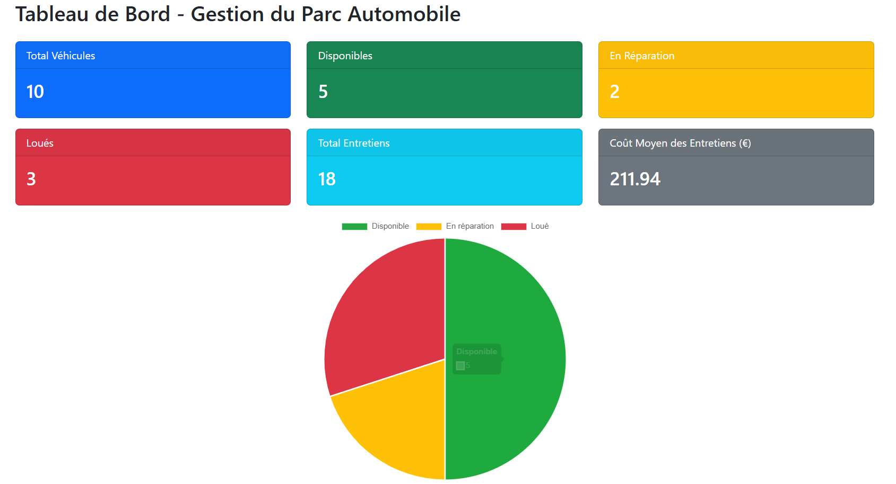
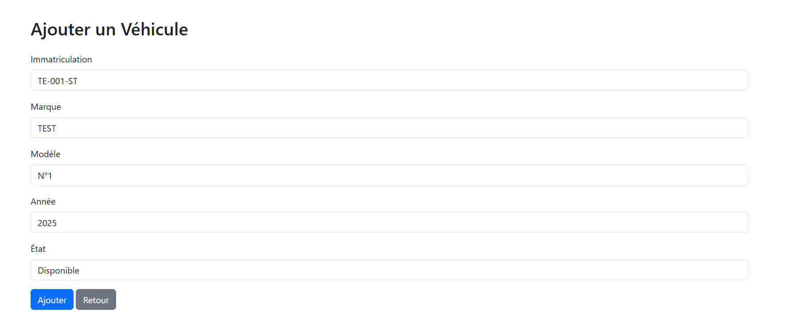
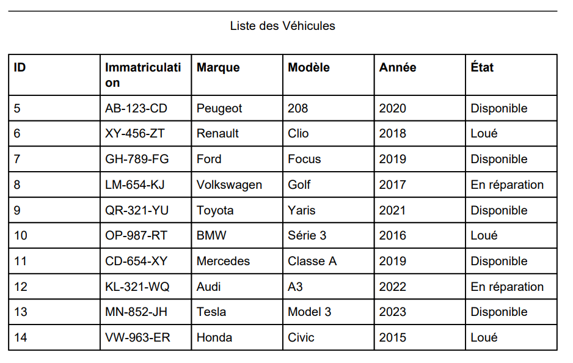

# 🚗 Gestion de parc automobile

Projet réalisé dans le cadre de mon BTS SIO (option SLAM), visant à gérer efficacement un parc de véhicules via une application web développée en PHP / MySQL.

---

## 🧾 Présentation

Cette application permet à une entreprise de :
- Suivre les véhicules disponibles
- Gérer les entretiens et les historiques
- Visualiser des statistiques sur le parc
- Exporter des rapports au format PDF
- Accéder à une interface sécurisée (connexion admin)

Le projet a été développé en local avec **WAMP** et **PhpMyAdmin**.

---

## 🧩 Fonctionnalités principales

✅ Gestion CRUD des véhicules  
✅ Historique des entretiens pour chaque véhicule  
✅ Tableau de bord avec statistiques dynamiques (Chart.js)  
✅ Export des données en PDF (TCPDF)  
✅ Recherche, tri et filtres avancés  
✅ Interface responsive avec **Bootstrap**  
✅ Authentification administrateur  
✅ Sécurité renforcée (vérification ID, inputs protégés)

---

## 📸 Aperçus

> Quelques captures de l'application

<p align="center">
  
  <br/>
  
  <br/>
  
</p>


---

## 🛠️ Technologies utilisées

- **Langages** : PHP, HTML, CSS, JavaScript
- **Base de données** : MySQL (via PhpMyAdmin)
- **Frontend** : Bootstrap, Chart.js
- **Backend** : PHP procédural (séparé du HTML)
- **Export PDF** : TCPDF
- **Serveur local** : WAMP

---

## 🧠 Objectifs pédagogiques

Ce projet m'a permis de :
- Approfondir mes compétences en PHP et SQL
- Structurer un projet selon une logique MVC simplifiée
- Mettre en œuvre des concepts de sécurité web
- Créer une interface utilisateur agréable et fonctionnelle
- Gérer un projet complet de A à Z, de la conception au rendu

---

## 📂 Organisation du projet

```txt
/config/          → Fichiers de configuration (connexion DB)
/models/          → Fichiers liés aux requêtes MySQL
/views/           → Pages HTML avec inclusion dynamique
/assets/          → Images, CSS, JS
/export/          → Génération de PDF
index.php         → Page d’accueil / listing
ajout.php         → Formulaire d’ajout
modifier.php      → Modification véhicule
supprimer.php     → Suppression avec confirmation
dashboard.php     → Statistiques globales
login.php         → Authentification admin
